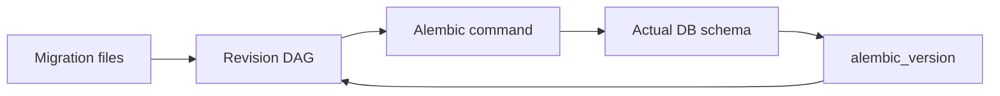

# Revision Lab 핵심 개념

## 1. 제품 원칙

Revision Lab의 핵심은 “명령 실행 결과”가 아니라 다음 세 상태가 어떻게 함께 이동하는지 보여주는 것이다.



- 파일 상태: revision 파일에 어떤 `upgrade()`와 `downgrade()`가 있는가
- Alembic 상태: base에서 여러 head까지 어떤 DAG가 만들어졌는가
- DB 상태: 실제 schema와 `alembic_version`이 어느 revision을 가리키는가

파일에 head가 존재하는 것과 DB가 그 head까지 upgrade된 것은 다른 상태다. UI는 둘을 하나의 “현재 버전”으로 합쳐 표현하지 않는다.

## 2. Alembic 용어

### Revision

하나의 migration 단위다. revision identifier와 부모를 가리키는 `down_revision`을 가진다. revision 파일이 존재한다고 DB에 적용된 것은 아니다.

### Base

부모 revision이 없는 DAG의 시작 상태다. 아직 아무 migration도 적용되지 않은 DB 상태를 나타낼 때도 사용한다.

### Head

자식 revision이 없는 DAG의 끝점이다. DAG에는 여러 head가 있을 수 있다. “최신 파일”이라는 시간 개념과 동일하지 않다.

### Current revision

실제 DB의 `alembic_version`이 기록한 revision이다. 파일 graph의 head와 다를 수 있다. branch가 여러 개 적용된 상황에서는 version table에 여러 행이 존재할 수도 있다.

### Branch point와 multiple heads

두 개발자가 같은 revision을 부모로 새 revision을 만들면 DAG가 갈라진다. 이것은 revision ID 충돌과 다른 문제다. 서로 다른 ID여도 공통 부모에서 갈라지면 multiple heads가 된다.

### Merge revision

복수 head를 하나의 revision으로 합치는 graph 전용 migration이다. `down_revision`이 tuple 형태로 여러 부모를 가리킨다. 두 migration의 실제 DDL 충돌까지 자동 해결해 주는 기능은 아니다.

### Upgrade와 downgrade

- `upgrade`: 현재 DB revision에서 목표 revision 방향으로 `upgrade()`를 실행한다.
- `downgrade`: 반대 방향으로 `downgrade()`를 실행한다.
- downgrade가 존재한다고 데이터 손실 없이 되돌릴 수 있다는 뜻은 아니다.

### Autogenerate

현재 DB schema와 SQLAlchemy `target_metadata`를 비교해 migration 후보를 만든다. 최종 정답 생성기가 아니며 rename, 데이터 migration, 일부 constraint와 dialect 고유 기능은 개발자가 검토해야 한다.

### Online migration

Alembic이 SQLAlchemy connection을 통해 실제 DB에 접속해서 migration을 실행하는 방식이다. Revision Lab의 SQLite와 PostgreSQL 모드는 모두 online migration을 목표로 한다.

## 3. 두 DB 모드의 의미

### SQLite 모드

Pyodide의 Python 프로세스 안에서 SQLAlchemy가 SQLite DBAPI에 직접 연결한다. 별도의 JavaScript SQLite 구현과 schema를 복제하지 않는다.

이 모드는 Alembic의 기본 흐름과 SQLite batch migration의 특성을 배우는 데 사용한다.

### PostgreSQL 모드

PGlite는 브라우저에서 실행되는 실제 PostgreSQL WASM 런타임이다. 그러나 Python DBAPI가 아니므로 다음 bridge를 둔다.

```text
Alembic -> SQLAlchemy -> pglite_dbapi -> synchronous Worker RPC -> PGlite
```

Pyodide Worker는 동기 DBAPI 계약을 유지하고, PGlite Worker의 Promise 기반 실행은 `SharedArrayBuffer`와 `Atomics`로 기다린다. 따라서 PostgreSQL 모드는 Alembic이 생성한 SQL을 단순히 복사해 실행하는 offline simulation이 아니라 SQLAlchemy connection을 사용하는 online 경로다.

브라우저의 실제 PostgreSQL 서버 네트워크, 사용자 권한, multi-connection 경쟁까지 재현하는 것은 아니다.

## 4. 협업 실습이 가르치는 것

Alice와 Bob 실습은 다음 차이를 명시적으로 보여준다.

- revision ID 자체가 같은 충돌
- 서로 다른 revision ID지만 동일 부모에서 갈라진 multiple heads
- 두 migration이 같은 테이블이나 컬럼을 수정해서 생기는 DDL 충돌
- graph를 합치는 merge revision과 업무 의미를 합치는 코드 수정의 차이

“PR 합치기”는 실제 Git UI를 모사하는 것이 목적이 아니다. 독립된 파일 집합이 하나의 Alembic script directory에 들어올 때 graph와 DB에서 무엇이 발생하는지를 재현한다.

## 5. 화면 표현 원칙

- graph의 file head와 DB current marker를 별도로 표시한다.
- 명령 성공 여부와 schema 변화 여부를 별도로 표시한다.
- 원본 stdout/stderr/traceback을 숨기지 않고 학습용 설명을 옆에 제공한다.
- autogenerate 결과는 즉시 적용하지 않고 편집기에서 검토하도록 한다.
- SQLite와 PostgreSQL 결과가 다르면 이를 오류가 아니라 dialect 차이로 설명한다.
- migration 실패 후에는 rollback을 가정하지 않고 DB를 다시 inspect해 실제 상태를 보여준다.

