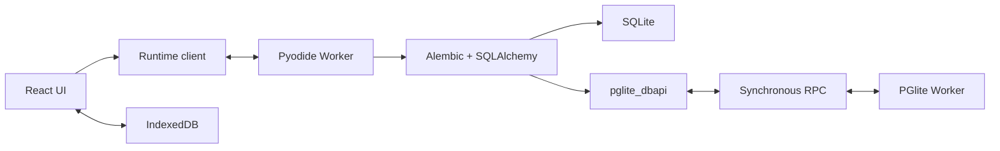

# Revision Lab MVP 기술 명세

## 1. 고정 기술 스택

| 영역 | 선택 |
|---|---|
| 개발 환경 | mise, Node 24.11.0, pnpm 11.19.0 |
| 애플리케이션 | React, TypeScript, Vite, pnpm |
| 편집기 | CodeMirror 6 |
| Revision graph | `@xyflow/react` |
| UI 상태 | Zustand |
| Python runtime | Pyodide 314.0.6 Web Worker |
| Migration | Alembic 1.19.1, SQLAlchemy 2.0.48 |
| SQLite | Pyodide에 포함된 Python `sqlite3` |
| PostgreSQL | `@electric-sql/pglite` 0.5.8 전용 Worker |
| 영속화 | IndexedDB |
| 테스트 | Vitest, Testing Library, Playwright |
| 배포 | Cloudflare Pages 정적 호스팅 |

`py-pglite`는 Node 자식 프로세스, npm, psutil, TCP/Unix socket을 요구하므로 사용하지 않는다. PGlite JavaScript 패키지를 브라우저 Worker에서 직접 실행한다.

런타임 버전은 lockfile과 정적 asset manifest에 고정한다. Pyodide wheel과 PGlite WASM을 런타임에 임의 CDN 또는 PyPI 최신 버전으로 가져오지 않는다.

## 2. 전체 구조



### 2.1 Main thread

- React 렌더링과 사용자 입력만 담당한다.
- Runtime client가 request ID, workspace ID, protocol version을 부여한다.
- Pyodide Worker와 PGlite Worker를 생성하고 `MessageChannel`의 양쪽 port를 전달한다.
- runtime snapshot을 표시하지만 파일·revision·DB 상태의 진실 공급원이 되지 않는다.
- UI가 임의로 성공 상태를 추정하지 않고 Worker가 반환한 snapshot만 반영한다.

### 2.2 Pyodide Worker

- Pyodide, Alembic, SQLAlchemy와 앱의 Python runtime package를 초기화한다.
- workspace별 Emscripten 파일시스템과 SQLite DB를 관리한다.
- Alembic 명령을 공개 Python Command API로 실행한다.
- PostgreSQL 모드에서는 `pglite_dbapi`와 `postgresql+pglite` dialect를 제공한다.
- stdout, stderr, traceback, 변경 파일, revision graph와 schema snapshot을 직렬화한다.

### 2.3 PGlite Worker

- workspace별 하나의 PGlite instance를 `idb://revision-lab/<workspace-id>`에 연다.
- SQL 실행과 DB dump/restore/reset만 담당한다.
- Alembic 파일, lesson 상태, UI 상태를 알지 못한다.
- 동시에 하나의 RPC만 처리한다. 순서를 보장하지 못하는 요청은 `RPC_BUSY`로 거절한다.

## 3. 런타임 메시지 계약

모든 메시지는 discriminated union으로 정의하고 TypeScript와 Python 양쪽 fixture로 호환성을 검사한다.

```ts
type ProtocolEnvelope = {
  protocolVersion: 1;
  requestId: string;
  workspaceId: string;
};

type DatabaseMode = "sqlite" | "postgresql";

type RuntimeRequest = ProtocolEnvelope & (
  | { type: "BOOT" }
  | { type: "CREATE_WORKSPACE"; mode: DatabaseMode }
  | { type: "RUN_ALEMBIC"; argv: string[] }
  | { type: "READ_FILE"; path: string }
  | { type: "WRITE_FILE"; path: string; content: string }
  | { type: "INSPECT" }
  | { type: "SAVE_CHECKPOINT" }
  | { type: "RESTORE_CHECKPOINT"; checkpointId: string }
  | { type: "RESET_WORKSPACE" }
  | { type: "EXPORT_WORKSPACE" }
  | { type: "IMPORT_WORKSPACE"; archive: ArrayBuffer }
);
```

주요 응답은 다음과 같다.

- `READY`: runtime 및 engine version, capability 결과
- `PROGRESS`: 초기화/설치/명령/inspect 단계
- `COMMAND_OUTPUT`: stdout 또는 stderr의 순서 지정 chunk
- `COMMAND_RESULT`: 성공 여부, exit 성격, traceback, 변경 파일과 실행 전후 snapshot
- `FILE_CONTENT`
- `STATE_SNAPSHOT`
- `WORKSPACE_ARCHIVE`
- `RUNTIME_ERROR`: 안정적인 error code와 원본 message

지원하지 않는 protocol version, message type, Alembic 명령 또는 옵션은 실행 전에 거절한다.

## 4. 동기 PGlite Worker RPC

### 4.1 Transport

- Main thread가 하나의 `MessageChannel`과 `SharedArrayBuffer` 두 개를 만든다.
- control buffer는 최소 64 bytes이며 state, response length, request sequence를 `Int32Array`로 저장한다.
- response buffer는 8MiB 고정 크기의 UTF-8 tagged JSON 영역이다.
- Pyodide Worker는 request body를 PGlite Worker의 port로 structured clone한 뒤 control state를 `WAITING`으로 두고 `Atomics.wait()`한다.
- PGlite Worker는 완료 결과를 response buffer에 쓰고 length와 `OK` 또는 `ERROR` state를 저장한 뒤 `Atomics.notify()`한다.
- sequence가 현재 request와 다르면 응답을 폐기하고 `RPC_PROTOCOL_ERROR`로 처리한다.
- request는 한 번에 하나만 허용하므로 복수 응답용 ring buffer는 MVP에서 구현하지 않는다.

```ts
type PgRpcRequest = ProtocolEnvelope & (
  | { op: "QUERY"; sql: string; params: TaggedValue[] }
  | { op: "EXECUTE_MANY"; sql: string; paramSets: TaggedValue[][] }
  | { op: "RESET" }
  | { op: "DUMP" }
  | { op: "RESTORE"; data: ArrayBuffer }
  | { op: "CLOSE" }
);

type PgRpcResponse =
  | {
      ok: true;
      rows: TaggedValue[][];
      fields: Array<{ name: string; dataTypeId: number }>;
      rowCount: number;
      commandTag?: string;
    }
  | {
      ok: false;
      error: {
        code: string;
        message: string;
        sqlState?: string;
        detail?: string;
        hint?: string;
      };
    };
```

### 4.2 값 codec

Tagged JSON codec은 다음 값을 손실 없이 처리한다.

- null, boolean, finite number, string
- bigint: decimal string
- numeric/decimal: decimal string
- date, time, timestamp: ISO string과 원래 PostgreSQL type ID
- `bytea`: base64
- 1차원 array: element별 tagged value

지원하지 않는 값은 문자열로 암묵 변환하지 않고 `UNSUPPORTED_VALUE_TYPE`으로 실패한다. `NaN`과 infinity도 명시적인 tag로만 전달한다.

### 4.3 Timeout과 복구

- 개별 RPC timeout은 15초다.
- 전체 Alembic 명령 timeout은 30초다.
- timeout 이후 해당 DBAPI connection을 broken 상태로 표시하고 추가 query를 거절한다.
- Main thread는 두 Worker를 종료하고 마지막 성공 체크포인트에서 workspace를 복원한다.
- checkpoint가 없으면 빈 workspace로 돌아가지 않고 복구 불가 오류와 reset 선택지를 표시한다.

## 5. Python DBAPI와 PostgreSQL dialect

### 5.1 DBAPI 표면

`pglite_dbapi`는 Alembic과 SQLAlchemy가 사용하는 PEP 249 호환 표면만 구현한다.

- module: `apilevel`, `threadsafety = 1`, `paramstyle = "numeric_dollar"`, `connect()`
- connection: `cursor()`, `commit()`, `rollback()`, `close()`, `autocommit`, broken/closed 상태
- cursor: `execute()`, `executemany()`, `fetchone()`, `fetchmany()`, `fetchall()`, `close()`, `description`, `rowcount`, `arraysize`
- exception: `Warning`, `Error`, `InterfaceError`, `DatabaseError`, `DataError`, `OperationalError`, `IntegrityError`, `InternalError`, `ProgrammingError`, `NotSupportedError`

SQLSTATE class와 PGlite 오류 정보를 사용해 가능한 가장 구체적인 DBAPI 예외로 매핑한다. 원본 message/detail/hint/sqlState는 예외 객체에 보존한다.

### 5.2 Transaction

- `autocommit = false`인 connection은 첫 statement 직전에 `BEGIN`을 실행한다.
- `commit()`은 활성 transaction에서만 `COMMIT`하고 상태를 초기화한다.
- `rollback()`은 활성 transaction에서 `ROLLBACK`하며 활성 transaction이 없으면 no-op이다.
- SQLAlchemy가 isolation level을 AUTOCOMMIT으로 전환하면 implicit `BEGIN`을 생략한다.
- Worker RPC 실패 또는 timeout 이후 commit으로 성공 상태를 가장하지 않는다.

### 5.3 SQLAlchemy dialect

- URL scheme은 `postgresql+pglite://`다.
- PostgreSQL base dialect를 상속하되 driver-specific socket, encoding, server-side cursor 동작은 사용하지 않는다.
- SQLAlchemy Inspector가 table, column, PK/FK, unique/check, index를 읽을 수 있어야 한다.
- Alembic autogenerate와 PostgreSQL transactional DDL을 지원한다.
- COPY, large object, server-side cursor, two-phase transaction, 멀티 connection pool은 `NotSupportedError`로 명시한다.
- MVP engine pool은 단일 logical connection을 재사용하는 형태로 제한한다.

## 6. Alembic 실행기

- 입력 문자열은 UI에서 shell로 실행하지 않는다. Python `shlex`로 분리한 argv를 허용 목록 validator에 통과시킨다.
- 실행은 Alembic의 `command` 모듈과 `Config` 객체를 사용한다.
- 허용 명령: `init`, `revision`, `upgrade`, `downgrade`, `current`, `history`, `heads`, `branches`, `show`, `merge`.
- 명령별 지원 option도 allowlist로 관리한다. 파일 경로는 workspace root 밖으로 나갈 수 없다.
- 각 명령 전후에 파일 manifest, revision DAG, DB schema를 읽어 diff를 만든다.
- 성공한 명령과 저장된 편집만 checkpoint 후보가 된다. 실패한 migration의 DB 실제 상태는 별도로 inspect하지만 성공 checkpoint를 덮어쓰지 않는다.

## 7. 상태와 영속화

```ts
type SchemaSnapshot = {
  dialect: DatabaseMode;
  tables: TableSnapshot[];
  alembicVersion: string[];
};

type RevisionNode = {
  revision: string;
  downRevisions: string[];
  branchLabels: string[];
  isHead: boolean;
  isBranchPoint: boolean;
  isMergePoint: boolean;
  isCurrent: boolean;
};

type WorkspaceArchiveV1 = {
  formatVersion: 1;
  workspace: { id: string; name: string; mode: DatabaseMode };
  files: Array<{ path: string; encoding: "utf8" | "base64"; content: string }>;
  database: { format: "sqlite-file" | "pglite-datadir"; content: ArrayBuffer };
  lessonProgress: Record<string, string>;
};
```

- graph는 Alembic `ScriptDirectory`에서 생성한다.
- schema는 SQLAlchemy Inspector 결과를 정규화하되 raw type SQL을 보존한다.
- UI store는 선택된 파일, 열린 패널, 실행 중 상태만 소유한다.
- IndexedDB에는 workspace metadata, checkpoint, lesson progress만 저장한다.
- archive import 시 format version, 경로 traversal, 압축 해제 크기, 파일 개수를 검증한다.

## 8. 배포와 보안

Cloudflare Pages의 정적 `_headers`에 최소 다음 정책을 둔다.

```text
/*
  Cross-Origin-Opener-Policy: same-origin
  Cross-Origin-Embedder-Policy: require-corp
  X-Content-Type-Options: nosniff
  Referrer-Policy: no-referrer
```

- 시작 시 secure context, `crossOriginIsolated`, SharedArrayBuffer, Worker, WebAssembly, IndexedDB를 진단한다.
- isolation을 사용할 수 없으면 PostgreSQL 모드는 비활성화하고 SQLite는 계속 제공한다.
- production 자산은 same-origin으로 제공한다.
- migration Python은 Worker 안에서 실행하지만 임의 코드라는 사실을 UI에 알린다.
- 외부 archive는 사용자 확인 전 실행하지 않는다.
- 공개 배포, commit, push는 별도 명시적 승인 없이는 수행하지 않는다.
