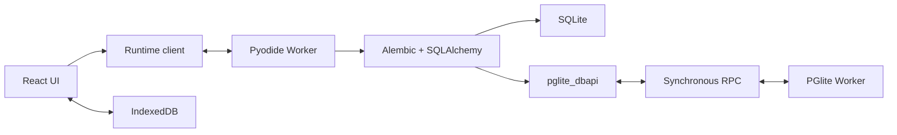

# Revision Lab MVP 기술 명세

## 1. 고정 기술 스택

| 영역 | 선택 |
|---|---|
| 개발 환경 | mise, Node 24.11.0, pnpm 11.19.0 |
| 애플리케이션 | React, TypeScript, Vite, pnpm |
| 편집기 | CodeMirror 6 |
| Revision graph | `@xyflow/react` |
| UI 상태 | Zustand |
| Python runtime | Pyodide 314.0.6 Web Worker |
| Migration | Alembic 1.19.1, SQLAlchemy 2.0.48 |
| SQLite | Pyodide에 포함된 Python `sqlite3` |
| PostgreSQL | `@electric-sql/pglite` 0.5.8 전용 Worker |
| 영속화 | IndexedDB |
| 테스트 | Vitest, Testing Library, Playwright |
| 배포 | Cloudflare Pages 정적 호스팅 |

`py-pglite`는 Node 자식 프로세스, npm, psutil, TCP/Unix socket을 요구하므로 사용하지 않는다. PGlite JavaScript 패키지를 브라우저 Worker에서 직접 실행한다.

런타임 버전은 lockfile과 정적 asset manifest에 고정한다. Pyodide wheel과 PGlite WASM을 런타임에 임의 CDN 또는 PyPI 최신 버전으로 가져오지 않는다.

## 2. 전체 구조



### 2.1 Main thread

- React 렌더링과 사용자 입력만 담당한다.
- Runtime client가 request ID, workspace ID, protocol version을 부여한다.
- Pyodide Worker와 PGlite Worker를 생성하고 `MessageChannel`의 양쪽 port를 전달한다.
- RPC connection이 broken 상태가 되면 PGlite instance는 유지하고 새 Pyodide Worker, `MessageChannel`, SharedArrayBuffer로 재연결한다.
- runtime snapshot을 표시하지만 파일·revision·DB 상태의 진실 공급원이 되지 않는다.
- UI가 임의로 성공 상태를 추정하지 않고 Worker가 반환한 snapshot만 반영한다.

### 2.2 Pyodide Worker

- Pyodide, Alembic, SQLAlchemy와 앱의 Python runtime package를 초기화한다.
- workspace별 Emscripten 파일시스템과 SQLite DB를 관리한다.
- Alembic 명령을 공개 Python Command API로 실행한다.
- PostgreSQL 모드에서는 `pglite_dbapi`와 `postgresql+pglite` dialect를 제공한다.
- stdout, stderr, traceback, 변경 파일, revision graph와 schema snapshot을 직렬화한다.

### 2.3 PGlite Worker

- runtime instance마다 고유한 단일 경로 segment를 사용해 `idb://revision-lab-<workspace-id>-<runtime-id>`에 PGlite를 연다. PGlite 0.5.8 IDBFS는 중첩 mount 경로를 만들지 못하므로 `/`가 포함된 data directory 이름은 사용하지 않는다.
- 같은 workspace의 `RECONNECT_PGLITE` 메시지로 새 RPC port와 buffer를 받아 기존 PGlite instance를 재사용한다.
- 전체 Worker 복구는 마지막 성공 dump를 새 runtime ID에 적재한 뒤 이전 runtime의 IndexedDB database를 비동기로 정리한다. 페이지를 떠나는 Worker가 WebKit에서 database deletion을 막아도 새 runtime 부팅을 막지 않는다.
- SQL 실행과 DB dump/restore/reset만 담당한다.
- Alembic 파일, lesson 상태, UI 상태를 알지 못한다.
- 동시에 하나의 RPC만 처리한다. 순서를 보장하지 못하는 요청은 `RPC_BUSY`로 거절한다.

## 3. 런타임 메시지 계약

모든 메시지는 discriminated union으로 정의하고 TypeScript와 Python 양쪽 fixture로 호환성을 검사한다.

```ts
type ProtocolEnvelope = {
  protocolVersion: 1;
  requestId: string;
  workspaceId: string;
};

type DatabaseMode = "sqlite" | "postgresql";

type RuntimeRequest = ProtocolEnvelope & (
  | { type: "BOOT" }
  | { type: "CREATE_WORKSPACE"; mode: DatabaseMode }
  | { type: "RUN_ALEMBIC"; argv: string[] }
  | { type: "RUN_COMMAND"; command: string }
  | { type: "READ_TABLE"; table: string }
  | { type: "READ_FILE"; path: string }
  | { type: "WRITE_FILE"; path: string; content: string }
  | { type: "INSPECT" }
  | { type: "SAVE_CHECKPOINT" }
  | { type: "RESTORE_CHECKPOINT"; checkpointId: string }
  | { type: "RESET_WORKSPACE" }
  | { type: "EXPORT_WORKSPACE" }
  | { type: "IMPORT_WORKSPACE"; archive: ArrayBuffer }
);
```

주요 응답은 다음과 같다.

- `READY`: runtime 및 engine version, capability 결과
- `PROGRESS`: 초기화/설치/명령/inspect 단계
- `COMMAND_OUTPUT`: stdout 또는 stderr의 순서 지정 chunk
- `COMMAND_RESULT`: 성공 여부, exit 성격, traceback, 변경 파일과 실행 전후 snapshot
- `FILE_CONTENT`
- `STATE_SNAPSHOT`
- `WORKSPACE_ARCHIVE`
- `RUNTIME_ERROR`: 안정적인 error code와 원본 message

지원하지 않는 protocol version, message type, Alembic 명령 또는 옵션은 실행 전에 거절한다.

## 4. 동기 PGlite Worker RPC

### 4.1 Transport

- Main thread가 하나의 `MessageChannel`과 `SharedArrayBuffer` 두 개를 만든다.
- control buffer는 최소 64 bytes이며 state, response length, request sequence를 `Int32Array`로 저장한다.
- response buffer는 8MiB 고정 크기의 UTF-8 tagged JSON 영역이다.
- Pyodide Worker는 request body를 PGlite Worker의 port로 structured clone한 뒤 control state를 `WAITING`으로 두고 `Atomics.wait()`한다.
- PGlite Worker는 완료 결과를 response buffer에 쓰고 length와 `OK` 또는 `ERROR` state를 저장한 뒤 `Atomics.notify()`한다.
- sequence가 현재 request와 다르면 응답을 폐기하고 `RPC_PROTOCOL_ERROR`로 처리한다.
- request는 한 번에 하나만 허용하므로 복수 응답용 ring buffer는 MVP에서 구현하지 않는다.

```ts
type PgRpcRequest = ProtocolEnvelope & (
  | { op: "QUERY"; sql: string; params: TaggedValue[] }
  | { op: "EXECUTE_MANY"; sql: string; paramSets: TaggedValue[][] }
  | { op: "RESET" }
  | { op: "DUMP" }
  | { op: "RESTORE"; data: ArrayBuffer }
  | { op: "CLOSE" }
);

type PgRpcResponse =
  | {
      ok: true;
      rows: TaggedValue[][];
      fields: Array<{ name: string; dataTypeId: number }>;
      rowCount: number;
      commandTag?: string;
    }
  | {
      ok: false;
      error: {
        code: string;
        message: string;
        sqlState?: string;
        detail?: string;
        hint?: string;
      };
    };
```

### 4.2 값 codec

Tagged JSON codec은 다음 값을 손실 없이 처리한다.

- null, boolean, finite number, string
- bigint: decimal string
- numeric/decimal: decimal string
- date, time, timestamp: ISO string과 원래 PostgreSQL type ID
- `bytea`: base64
- 1차원 array: element별 tagged value

지원하지 않는 값은 문자열로 암묵 변환하지 않고 `UNSUPPORTED_VALUE_TYPE`으로 실패한다. `NaN`과 infinity도 명시적인 tag로만 전달한다.

### 4.3 Timeout과 복구

- 개별 RPC timeout은 15초다.
- 전체 Alembic 명령 timeout은 30초다.
- timeout 이후 해당 DBAPI connection을 broken 상태로 표시하고 추가 query를 거절한다.
- Main thread는 Pyodide Worker를 종료한 뒤 기존 PGlite Worker에 새 RPC port와 buffer를 연결한다.
- PGlite Worker 자체가 crash한 경우에만 Worker를 새로 만들고 마지막 성공 체크포인트에서 workspace를 복원한다.
- checkpoint가 없으면 빈 workspace로 돌아가지 않고 복구 불가 오류와 reset 선택지를 표시한다.

## 5. Python DBAPI와 PostgreSQL dialect

### 5.1 DBAPI 표면

`pglite_dbapi`는 Alembic과 SQLAlchemy가 사용하는 PEP 249 호환 표면만 구현한다.

- module: `apilevel`, `threadsafety = 1`, `paramstyle = "numeric_dollar"`, `connect()`
- connection: `cursor()`, `commit()`, `rollback()`, `close()`, `autocommit`, broken/closed 상태
- cursor: `execute()`, `executemany()`, `fetchone()`, `fetchmany()`, `fetchall()`, `close()`, `description`, `rowcount`, `arraysize`
- exception: `Warning`, `Error`, `InterfaceError`, `DatabaseError`, `DataError`, `OperationalError`, `IntegrityError`, `InternalError`, `ProgrammingError`, `NotSupportedError`

SQLSTATE class와 PGlite 오류 정보를 사용해 가능한 가장 구체적인 DBAPI 예외로 매핑한다. 원본 message/detail/hint/sqlState는 예외 객체에 보존한다.

### 5.2 Transaction

- `autocommit = false`인 connection은 첫 statement 직전에 `BEGIN`을 실행한다.
- `commit()`은 활성 transaction에서만 `COMMIT`하고 상태를 초기화한다.
- `rollback()`은 활성 transaction에서 `ROLLBACK`하며 활성 transaction이 없으면 no-op이다.
- SQLAlchemy가 isolation level을 AUTOCOMMIT으로 전환하면 implicit `BEGIN`을 생략한다.
- Worker RPC 실패 또는 timeout 이후 commit으로 성공 상태를 가장하지 않는다.

### 5.3 SQLAlchemy dialect

- URL scheme은 `postgresql+pglite://`다.
- PostgreSQL base dialect를 상속하되 driver-specific socket, encoding, server-side cursor 동작은 사용하지 않는다.
- SQLAlchemy Inspector가 table, column, PK/FK, unique/check, index를 읽을 수 있어야 한다.
- Alembic autogenerate와 PostgreSQL transactional DDL을 지원한다.
- PGlite의 extended query에서 Inspector의 `json_build_object` 문자열 매개변수 타입을 결정할 수 있도록 String bind cast를 활성화한다.
- PostgreSQL JSON/JSONB 결과는 PGlite parser에서 원문 JSON 문자열로 유지하고 tagged string으로 전달한다. SQLAlchemy JSON result processor가 Python에서 해석한다. Inspector identity 조회에서 JavaScript 객체 변환과 숫자 정밀도 손실을 피한다.
- COPY, large object, server-side cursor, two-phase transaction, 멀티 connection pool은 `NotSupportedError`로 명시한다.
- MVP engine pool은 단일 logical connection을 재사용하는 형태로 제한한다.

## 6. Alembic 실행기

- 입력 문자열은 UI에서 shell로 실행하지 않는다. Python `shlex`로 분리한 argv를 허용 목록 validator에 통과시킨다.
- 실행은 Alembic의 `command` 모듈과 `Config` 객체를 사용한다.
- 허용 명령: `init`, `revision`, `upgrade`, `downgrade`, `current`, `history`, `heads`, `branches`, `show`, `merge`.
- 명령별 지원 option도 allowlist로 관리한다. 파일 경로는 workspace root 밖으로 나갈 수 없다.
- 각 명령 전후에 파일 manifest, revision DAG, DB schema를 읽어 diff를 만든다.
- `AlembicRuntimeClient(mode, workspaceId?)`와 `alembic_runtime.py`를 두 모드의 공통 실행기로 사용한다. 기존 `SqliteRuntimeClient`는 SQLite 모드를 선택하는 호환 wrapper다.
- 생성되는 `env.py`는 PostgreSQL에서 dialect의 단일 연결 pool을 사용하고, `render_as_batch`는 SQLite에서만 활성화한다. 성공·실패 모두 engine을 dispose한 다음 실제 DB를 다시 inspect한다.
- 같은 workspace의 중복 요청은 `RUNTIME_BUSY`로 거절한다. DBAPI 오류의 원본 SQLSTATE/detail/hint를 명령 오류에 보존한다.
- 성공한 명령과 저장된 편집만 checkpoint 후보가 된다. 실패한 migration의 DB 실제 상태는 별도로 inspect하지만 성공 checkpoint를 덮어쓰지 않는다.

## 7. 상태와 영속화

```ts
type SchemaSnapshot = {
  dialect: DatabaseMode;
  tables: TableSnapshot[];
  alembicVersion: string[];
};

type RevisionNode = {
  revision: string;
  path?: string; // ScriptDirectory가 반환한 workspace 상대 경로
  downRevisions: string[];
  branchLabels: string[];
  isHead: boolean;
  isBranchPoint: boolean;
  isMergePoint: boolean;
  isCurrent: boolean;
};

type WorkspaceArchiveV1 = {
  formatVersion: 1;
  workspace: { id: string; name: string; mode: DatabaseMode };
  files: Array<{ path: string; encoding: "utf8" | "base64"; content: string }>;
  database: { format: "sqlite-file" | "pglite-datadir"; content: ArrayBuffer };
  lessonProgress: Record<string, string>;
};
```

- graph는 Alembic `ScriptDirectory`에서 생성한다.
- schema는 SQLAlchemy Inspector 결과를 정규화하되 raw type SQL을 보존한다.
- `ColumnSnapshot.type`은 해당 engine dialect로 compile한 표현을 사용한다. PostgreSQL `TIMESTAMP WITH TIME ZONE`, `JSONB`, `UUID`, `INTEGER[]` 등을 일반 문자열 타입으로 축약하지 않는다.
- UI store는 선택된 파일, 열린 패널, 실행 중 상태만 소유한다.
- IndexedDB에는 workspace metadata, checkpoint, lesson progress만 저장한다.
- 성공한 Alembic 명령, 저장된 파일, 새로 확인한 autogenerate revision 뒤에 파일과 실제 DB를 하나의 checkpoint로 저장한다. 실패한 명령과 저장하지 않은 초안은 마지막 성공 checkpoint를 덮어쓰지 않는다.
- PGlite dump는 WebKit의 Worker `Blob` 영속화 문제를 피하기 위해 IndexedDB에는 `ArrayBuffer`로 정규화하고 Worker 경계에서만 gzip `Blob`으로 변환한다. 명령 기록은 checkpoint당 최근 20개만 유지한다.
- archive import 시 format version, 경로 traversal·중복 경로, UTF-8, 암호화·분할·ZIP64, 압축 전후 크기와 파일 개수를 압축 해제 및 runtime 생성 전에 검증한다.

## 8. 배포와 보안

Cloudflare Pages의 정적 `_headers`에 최소 다음 정책을 둔다.

```text
/*
  Content-Security-Policy: default-src 'self'; script-src 'self' 'wasm-unsafe-eval'; worker-src 'self' blob:; connect-src 'self'; img-src 'self' data:; style-src 'self' 'unsafe-inline'; font-src 'self'; object-src 'none'; base-uri 'self'; form-action 'self'; frame-ancestors 'none'
  Cross-Origin-Opener-Policy: same-origin
  Cross-Origin-Embedder-Policy: require-corp
  Cross-Origin-Resource-Policy: same-origin
  X-Content-Type-Options: nosniff
  Referrer-Policy: no-referrer
```

- 시작 시 secure context, `crossOriginIsolated`, SharedArrayBuffer, Worker, WebAssembly, IndexedDB를 진단한다.
- isolation을 사용할 수 없으면 PostgreSQL 모드는 비활성화하고 SQLite는 계속 제공한다.
- production 자산은 same-origin으로 제공한다.
- migration Python은 Worker 안에서 실행하지만 임의 코드라는 사실을 UI에 알린다.
- 외부 archive는 manifest와 파일 내용을 modal dialog에서 보여주며, Python 파일이 있으면 사용자가 검토 checkbox를 확인하기 전 runtime을 생성하거나 코드를 실행하지 않는다.
- PGlite 0.5.8의 PostgreSQL WASM 동적 module loader가 직접 `eval`을 사용하므로 `'unsafe-eval'`은 hash가 붙은 전용 `pglite.worker-*.js` 응답에만 허용한다. document와 나머지 asset CSP에는 허용하지 않는다.
- 공개 배포, commit, push는 별도 명시적 승인 없이는 수행하지 않는다.

## 9. 구현 범위와 후속 작업

- T1~T8의 두 DB Alembic runtime, Lab UI, lesson·협업, IndexedDB checkpoint, 자동 복구, archive와 CSP가 구현되어 있다.
- T2 기술 검증 client의 PGlite 재연결 기능은 유지한다. 공통 Alembic client의 전체 Worker crash·timeout은 마지막 성공 checkpoint의 파일과 실제 DB dump로 새 runtime을 만들며, checkpoint가 없거나 복구 부팅이 실패하면 자동 재시도 loop 없이 오류와 수동 복구·초기화 선택지를 표시한다.
- 실제 공개 URL 배포와 cold/warm cache 검증은 별도 승인이 필요한 T9 범위다.

## 10. T6 Lab UI 계약

- 화면의 workspace마다 독립 `AlembicRuntimeClient`를 생성한다. 메모리 사용을 제한하기 위해 동시에 최대 4개를 유지한다. 선택 전환은 기존 파일·DB·편집 초안을 유지한다.
- Zustand store는 Worker 응답의 snapshot을 표시용으로 보관하며, 선택 파일·revision·테이블·패널과 편집 초안·실행 상태를 관리한다. 성공, graph 또는 DB 상태를 합성하지 않는다.
- CodeMirror 6에서 Python, SQL, INI 파일을 편집한다. 저장 버튼 또는 Ctrl/⌘+S로 저장한다. 저장하지 않은 초안은 파일 및 workspace 전환에도 유지되며, 초안이 있으면 명령 실행을 차단한다.
- `RUN_COMMAND`는 `alembic`으로 시작하는 문자열을 Python `shlex`로 분리해 기존 Command API allowlist로 전달한다. shell 연산자 및 명령 치환 문자는 실행 전에 거절한다. 상대 revision `downgrade -1`도 지원한다.
- `PROGRESS`는 초기화·요청 처리 단계를 전달하는 비종결 응답이다. client는 이 메시지로 pending 요청을 완료하거나 실행 잠금을 해제하지 않는다. 진행률을 추정한 백분율은 표시하지 않는다.
- `RevisionNode.path`는 `ScriptDirectory`의 실제 revision 경로다. graph 노드, 파일 선택, DB current revision 링크가 이 경로로 연결된다. 파일 head와 DB current를 분리하며 branch/merge와 `depends_on` edge도 표시한다.
- `READ_TABLE`은 Inspector가 확인한 테이블만 SQLAlchemy로 읽고 `TABLE_DATA`를 반환한다. 임의 SQL 실행 API가 아니다. 최대 50행과 `truncated`를 반환하며 PK가 있으면 PK 순서, 없으면 DB 반환 순서를 사용한다. 직렬화된 데이터는 최대 1 MiB다.
- `TABLE_DATA`는 `{ table, columns, rows: TaggedValue[][], truncated }`다. 큰 정수·Decimal·시간·binary·array를 명시적으로 태그하고, UUID 및 JSON 객체는 명시적인 문자열 표현을 사용한다. 변환할 수 없는 값은 `UNSUPPORTED_VALUE_TYPE`으로 실패한다.
- schema 패널은 컬럼·원본 타입·PK/FK/unique/check/index, 별도의 실제 `alembic_version`을 표시한다. diff 패널은 마지막 파일 변경 목록과 마지막 명령의 schema 전후 상세를 표시한다. 파일의 줄 단위 diff는 T6 범위에 포함하지 않는다.
- 터미널과 로그 패널은 최근 100개 명령의 실제 stdout/stderr/traceback을 보관한다. 학습 설명은 별도 영역에 표시하며 T7 lesson validator를 대체하지 않는다.
- 실행 중에는 중복 명령·저장·workspace 전환을 차단한다. 패널 전환과 명령 입력은 계속 가능하다. 탭은 방향키/Home/End, graph는 동등한 키보드 revision 목록, 편집기는 Tab 이탈을 지원한다. 850px 이하에서는 단일 패널 탭 화면을 사용한다.
- migration 실패 후에는 반환된 실제 `after` snapshot을 표시한다. 상태 조회 자체가 실패하거나 실행기가 종료되면 마지막 snapshot임을 명시한다. idle Worker crash도 오류 UI에 알린다.
- T6에서 timeout 복구는 오류·복원 불가 안내와 사용자가 명시적으로 선택하는 새 workspace 생성까지 제공한다. 현재 workspace 초기화는 파일·DB 삭제 경고를 확인한 뒤 runtime을 종료하고 새 workspace로 교체한다. 체크포인트 저장·자동 복원은 T8이다.
- WebKit의 반복 Worker 생성에서 모듈 캐시 응답이 COEP로 차단되는 문제를 재현했다. production preview와 Cloudflare 정적 헤더에서 JS/MJS만 `Cache-Control: no-store`로 제공한다. WASM/data/wheel의 캐시 가능성은 유지한다. 개발 서버는 전체 `no-store`를 사용하고, preview는 304 응답에도 격리 헤더를 제공한다.

## 11. T7 교육 흐름과 협업 시뮬레이션 계약

- 가이드 모드와 자유 실습 모드는 같은 `AlembicRuntimeClient`와 `RUN_COMMAND` 경로를 사용한다. 가이드가 migration 결과를 생성하거나 성공 상태를 합성하지 않는다.
- 다섯 lesson은 `init`, 수동 revision, upgrade/downgrade, autogenerate 검토, Alice/Bob branch와 merge다. SQLite와 PostgreSQL에서 같은 정의와 validator를 사용한다.
- validator는 실제 workspace 파일 존재, `ScriptDirectory` revision graph, Inspector schema, `alembic_version`, 명령 전후 snapshot 전이를 중심으로 판정한다. autogenerate 여부처럼 상태만으로 구분할 수 없는 항목은 runtime이 반환한 구조화된 argv와 실제 생성 revision을 함께 사용하며 특정 파일 본문 문자열에는 의존하지 않는다.
- init, 미적용 수동 revision, upgrade, downgrade, autogenerate 생성·검토·적용, multiple-head 오류를 관찰한 이력은 현재 탭의 workspace 상태에 유지한다. 이후 DB 상태가 이동해도 이미 확인한 lesson 단계가 취소되지 않는다. T8 전에는 새로고침 후 유지하지 않는다.
- 협업 실습은 저장하지 않은 편집이 없고 DB current가 하나의 file head인 단일 workspace에서만 시작한다. 원본은 공통 Base가 되고 Alice, Bob, Integration 세 workspace를 추가해 최대 네 runtime을 사용한다.
- 내부 clone seed는 T7 세션 복제 전용이다. SQLite는 workspace 텍스트 파일과 최대 32 MiB의 실제 database 파일을 복제한다. PostgreSQL은 같은 파일과 PGlite `dumpDataDir()` 결과를 새 PGlite instance의 `loadDataDir`로 전달한다. 이는 T8의 IndexedDB checkpoint나 `WorkspaceArchiveV1` 공개 import/export 형식을 대신하지 않는다.
- “PR 파일 합치기”는 공통 base 이후 Alice와 Bob이 만든 revision 파일만 Integration runtime에 저장한다. 각 actor에 하나 이상의 독립 revision이 있어야 하며, 동일 파일 경로는 `REVISION_FILE_CONFLICT`로 중단한다.
- Integration의 multiple heads, 실패하는 `upgrade head`, 복수 `down_revision`을 가진 merge revision, merge head의 DB current 상태는 모두 실제 Alembic 결과로 판정한다. 같은 revision ID 충돌이나 DDL 충돌도 조용히 해결하지 않고 runtime 오류로 보여준다.
- 협업 그룹의 workspace를 초기화하면 연결된 Base, Alice, Bob, Integration runtime과 메모리 상태를 함께 제거한 뒤 새 단일 workspace를 만든다.

## 12. T8 저장, 복구 및 archive 계약

- IndexedDB `revision-lab-app`의 `checkpoints`와 `session` object store를 사용한다. workspace checkpoint와 session metadata는 같은 readwrite transaction으로 저장하고, 최대 네 workspace를 순서대로 복원한다.
- checkpoint에는 workspace 파일, SQLite database base64 또는 PGlite gzip dump `ArrayBuffer`, lesson evidence, 역할·협업 ID, 선택 파일·revision과 최근 명령 20개를 저장한다. DB schema와 graph는 복원 runtime이 다시 inspect한 실제 상태를 사용한다.
- 새로고침과 Worker crash·timeout은 동일한 restore 경로를 사용한다. 복원 부팅 중 발생한 실패는 다시 자동 복구하지 않아 무한 retry를 방지한다.
- `WorkspaceArchiveV1`은 실제 ZIP이며 `manifest.json`, index 기반 `files/*.txt`, `database.sqlite` 또는 `database.pglite.tgz`만 허용한다. 압축 archive는 40 MiB, DB는 32 MiB, 텍스트 파일은 각 1 MiB, 파일은 200개, 총 압축 해제 크기는 48 MiB로 제한한다.
- archive는 원래 workspace ID를 신뢰하거나 덮어쓰지 않고 새 workspace ID로 가져온다. mode와 database format이 일치해야 하며 선언되지 않은 ZIP entry, 중복 entry·파일 경로, 절대·상위·역슬래시 경로와 잘못된 UTF-8을 거절한다.
- ZIP 구현은 필요할 때만 동적으로 로드해 초기 앱 bundle에서 분리한다. 내보내기는 저장하지 않은 편집이 없을 때만 허용한다.
- reset은 runtime을 닫고 현재 PGlite IDBFS database와 앱 checkpoint를 삭제한 다음 같은 mode의 빈 workspace를 만든다. 협업 그룹이면 네 workspace를 함께 삭제한다.
